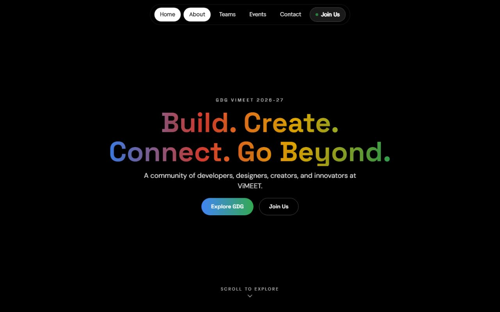
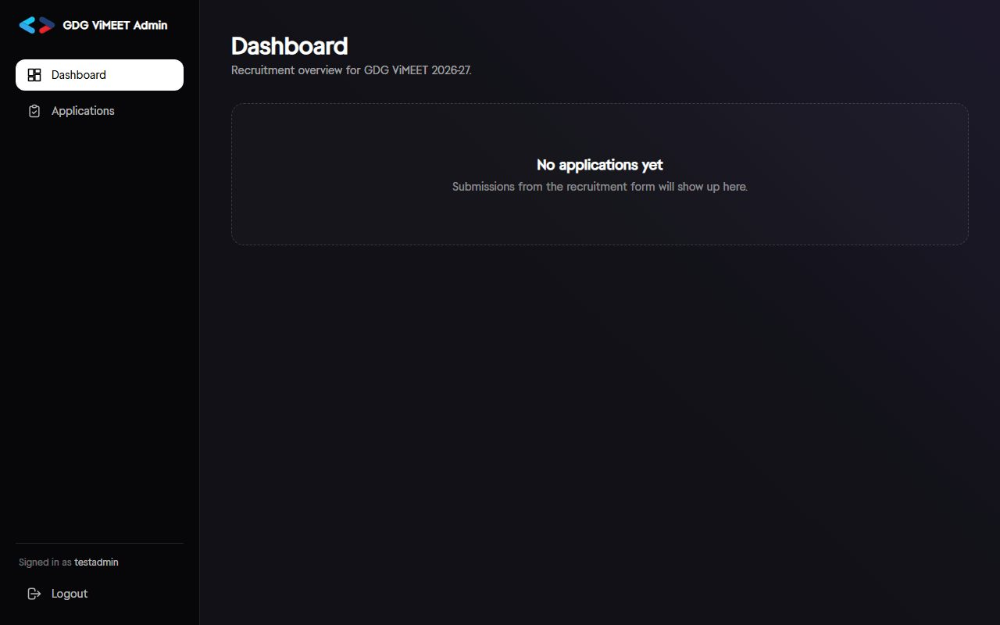
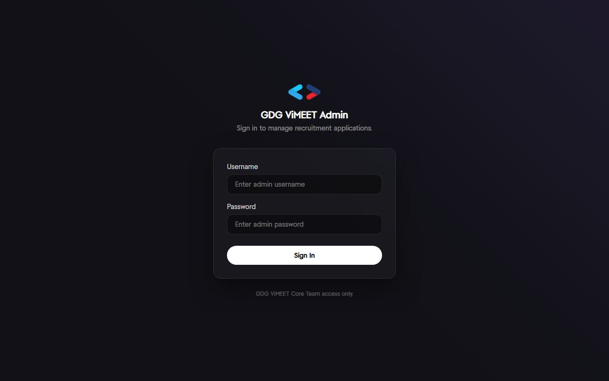
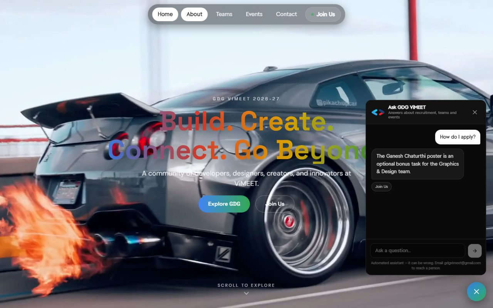
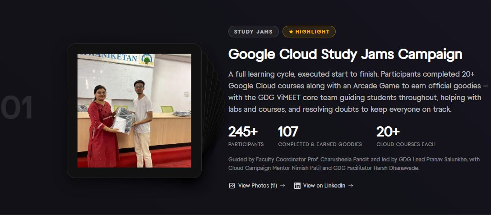

# GDG ViMEET

The website for **Google Developer Groups on Campus — ViMEET**, a student-led developer community at Vishwaniketan's Institute of Management, Entrepreneurship and Engineering Technology. It runs the chapter's public site, its recruitment pipeline, an admin dashboard for reviewing applications, and an AI FAQ assistant — in production, with real applicants.

**Live:** [gdg-vimeet.vercel.app](https://gdg-vimeet.vercel.app)



## What it does

- **Public site** — home, team, events (with photo galleries), contact, and a recruitment form across five teams (Technical, Graphics & Design, Content & Social Media, PR & Outreach, Event Management).
- **Recruitment pipeline** — applicants fill in one form; the backend validates and stores it, emails a confirmation with a WhatsApp invite, and syncs a live Excel workbook (one sheet per team) for the organising committee.
- **Admin dashboard** — a password-protected panel for the core team to search, filter, re-status, export and delete applications.
- **FAQ assistant** — a chat widget answering questions about recruitment, teams and events from a curated ~200-entry knowledge base, backed by Claude with Gemini as an automatic fallback.

| | |
|---|---|
|  |  |
|  |  |

## Architecture

```
Browser
  │
  ├─ static assets ───────────────► Vercel (React 19 + Vite, frontend/)
  │
  └─ /api/* ─── rewrite ──────────► Railway (Express 5, backend/) ─── MongoDB Atlas
                                          │
                                          ├─ Brevo (confirmation email)
                                          └─ Claude / Gemini (FAQ assistant)
```

Two npm workspaces (`frontend/`, `backend/`) in one repo, one root lockfile. The frontend never talks to the backend's own domain directly — Vercel rewrites `/api/*` to the Railway service, so every request the browser makes is same-origin.

### Why the `/api` rewrite exists

Admin auth is a JWT in an httpOnly cookie. With the frontend on `*.vercel.app` and the backend on `*.up.railway.app`, that cookie is cross-site — and Chrome and Safari's third-party-cookie policies drop it outright, `SameSite=None; Secure` or not. Login would appear to succeed and then every following request would silently come back 401. Routing everything through the Vercel rewrite makes the cookie first-party instead, which is the actual fix (see `frontend/src/services/db.js` and both `vercel.json` files).

### Admin auth

- Password is a bcrypt hash in an environment variable — never in the repo (`backend/scripts/hash-password.js` generates it).
- Session is a JWT in an httpOnly, `Secure`, `SameSite=None` cookie — not `localStorage`, so it can't be read or exfiltrated by client-side JavaScript.
- The frontend holds **no** client-side "is admin" state. `AdminGate` asks the backend `GET /api/admin/me` on every mount and renders nothing until it answers (`frontend/src/hooks/useAdminSession.js`).
- Every admin route is enforced server-side by `requireAdmin` (`backend/middleware/adminAuth.js`) — a hidden frontend route is not a security boundary here, the backend is.
- Login attempts are rate-limited per IP; admin responses are sent `Cache-Control: no-store`.

### FAQ assistant

`POST /api/chat` answers only from `backend/content/faq.json` (~200 entries), which is small enough to fit in a single Claude system prompt with prompt caching — no vector database needed at this scale. The model cites which FAQ entries it used; the backend turns those into clickable source links and strips anything it doesn't recognise, so a hallucinated citation can never reach the UI.

Claude and Gemini sit behind one interface (`backend/services/llm/`), selected by an environment variable, with automatic failover to the other provider on a rate limit or outage. The endpoint is public, so it's guarded independently of login: per-IP rate limits, a message-count and character cap, and a `CHAT_ENABLED` kill switch that returns 503 without a redeploy. `npm run check:faq` (also run in CI) validates the dataset's structure and checks that the facts it duplicates — team names, event titles, contact details — still exist in the frontend source.

## Tech stack

**Frontend** — React 19, Vite 6, Tailwind CSS 4, React Router 6. **GSAP + ScrollTrigger is the single animation engine** (the home-page scroll story, section reveals, the pointer parallax); everything else is CSS transitions. Every route is its own lazy chunk. Everything respects `prefers-reduced-motion`.

**Backend** — Express 5, Mongoose/MongoDB. `backend/utils/excel.js` builds a styled, multi-sheet workbook (one tab per team, frozen headers, autofilter, status colour-coding, IST-corrected timestamps) with ExcelJS. `backend/utils/email.js` sends over Brevo's HTTP API rather than SMTP, worked around a hosting provider that blocks outbound SMTP.

**Tests & CI** — `node:test` (no extra test framework) covering admin-auth token verification, the Excel builder, and application validation; GitHub Actions runs lint, build, `check:faq` and the test suite on every push and PR.

## Local setup

```bash
git clone <repo-url> && cd GDG_Vimeet
npm ci                        # installs both workspaces from the one root lockfile

cp backend/.env.example backend/.env
# fill in MONGODB_URI, then generate the admin credentials:
node backend/scripts/hash-password.js "your-chosen-password"
# paste the output into ADMIN_USERNAME / ADMIN_PASSWORD_HASH / JWT_SECRET in backend/.env

npm run start:backend    # http://localhost:3000
npm run dev:frontend     # http://localhost:5173, proxies /api to :3000
```

### Environment variables

| Variable | Where | Purpose |
|---|---|---|
| `MONGODB_URI` | backend | Database connection |
| `ADMIN_USERNAME`, `ADMIN_PASSWORD_HASH`, `JWT_SECRET` | backend | Admin login (see `hash-password.js` above) |
| `CORS_ORIGIN` | backend | Exact deployed frontend origin(s) — required for the admin cookie in production |
| `BREVO_API_KEY`, `EMAIL_USER` | backend | Applicant confirmation emails (skipped silently if unset) |
| `LLM_PROVIDER`, `ANTHROPIC_API_KEY`, `CHAT_MODEL` | backend | FAQ assistant, Claude — **a Claude Pro subscription does not include API access**; this is a separate pay-as-you-go key from console.anthropic.com |
| `GEMINI_API_KEY`, `GEMINI_MODEL` | backend | FAQ assistant, Gemini fallback |
| `CHAT_ENABLED` | backend | Set `false` to disable the assistant instantly |

Full list with comments: `backend/.env.example`.

## Scripts

```bash
npm run lint --workspace=frontend       # ESLint
npm run build --workspace=frontend      # production build
npm test --workspace=backend            # node:test suite
npm run check:faq --workspace=backend   # validates and syncs the FAQ dataset
```

## Project layout

```
frontend/src/
  sections/          route-level pages (Hero, ScrollStory, Events, EventDetail, Team, Contact, Recruitment, NotFound)
  sections/home/     the home-page sections after the scroll story (events, moments, about, find-your-place, team, final CTA)
  sections/admin/    admin dashboard, login, route guard
  story/             the scroll-story engine: poses, chapters, rig (rotation + orbit), the real logo mark
  components/ui/     Button, Chip/StatusChip, SectionHeader, TextLink, Photo, Lightbox, Avatar, Icon, SocialIcon, ColorStroke
  components/layout/ Container, Section, PageHeader, NavBar, SkipLink
  components/events/ EventCard, UpcomingCard
  components/chat/   the FAQ assistant widget
  data/              site config, events, team roster, recruitment teams, story copy — the source of truth for content
  animations/        gsap setup, motion tiers, section reveals
  hooks/ lib/        focus trap, modal flag, page meta · photo srcset, social glyphs, team icons
  services/          fetch wrappers — the only code that talks to the backend
frontend/scripts/    make-image-variants.mjs, find-unused-assets.mjs

backend/
  server.js          route definitions
  routes/            admin auth, chat
  middleware/        JWT auth, per-IP rate limiters
  services/llm/      Claude / Gemini provider adapter
  utils/             validation, Excel export, email, FAQ context builder
  content/faq.json   the FAQ dataset
```

## Design system

The site is light, built on a small set of tokens defined once in `frontend/src/index.css` (`@theme`) and used as Tailwind utilities — components never contain raw hex values.

| Token | Use |
|---|---|
| `text-ink` / `text-ink-2` | headings and body / secondary text (16.1 : 1 and 6.05 : 1 on white) |
| `bg-surface` / `bg-surface-2` | page / alternate section band |
| `primary` `#1A73E8`, `primary-strong` | links, buttons, focus ring (AA on white; use `primary-strong` for small text on the grey band) |
| `danger`, `success` + `*-tint` | errors, completed/open states and their chip backgrounds |
| `google-blue/red/yellow/green` | **decoration only** — shapes, the four-colour stroke, orbit dots (they fail AA as text) |
| `text-display` … `text-overline` | fluid type scale (Inter + JetBrains Mono, self-hosted) |
| `rounded-field` / `-card` / `-media` | 8 / 16 / 28 px radii |
| `shadow-rest` / `-raised` / `-overlay` | the three elevations |

The signature motif is the **four-colour stroke** (`ColorStroke`): active nav item, under headings, form success, the footer's last line.

### Where content lives (never hard-code it in JSX)

| To change… | Edit |
|---|---|
| tagline, social links, address, About copy and pillars, logo | `data/site.js` |
| events, dates, photo descriptions, the home "Moments" picks | `data/events.js` |
| the scroll-story words and Study Jams figures (the Events page reads the same numbers) | `data/story.js` |
| recruitment teams, interest clusters, whether applications are open | `data/recruitment.js`, `site.recruitmentOpen` (also flip `REGISTRATIONS_OPEN` in `backend/server.js`) |
| team members | `data/team.js` |

### How to add an event

1. Put the photos in `frontend/public/events/<slug>/1.webp, 2.webp …` (about 1600 px wide) and run `node scripts/make-image-variants.mjs` from `frontend/` — it writes the 480/960 px copies the site serves through `srcset` and strips metadata.
2. Add an entry to `rawPastEvents` (or `upcomingEvents`) in `data/events.js`: `slug`, `title`, `date` as `YYYY-MM-DD` (the Upcoming/Completed chip is derived from it — never set by hand), `category`, `desc`, `gallery: galleryPaths('<slug>', <count>)`, and one `photoAlts` line per photo describing the moment.
3. Add `/events/<slug>` to `frontend/public/sitemap.xml`. The event page, its gallery and lightbox, the Events list and the home page pick it up automatically.

### The scroll story

The home page's visual is the real GDG mark from the logo SVG (`#gdg-mark`, referenced with `<use>`, never redrawn) — one object that turns with scroll, with four small accent dots orbiting it. See [`docs/redesign/stage-3-notes.md`](docs/redesign/stage-3-notes.md) for the choreography and how to edit it.
