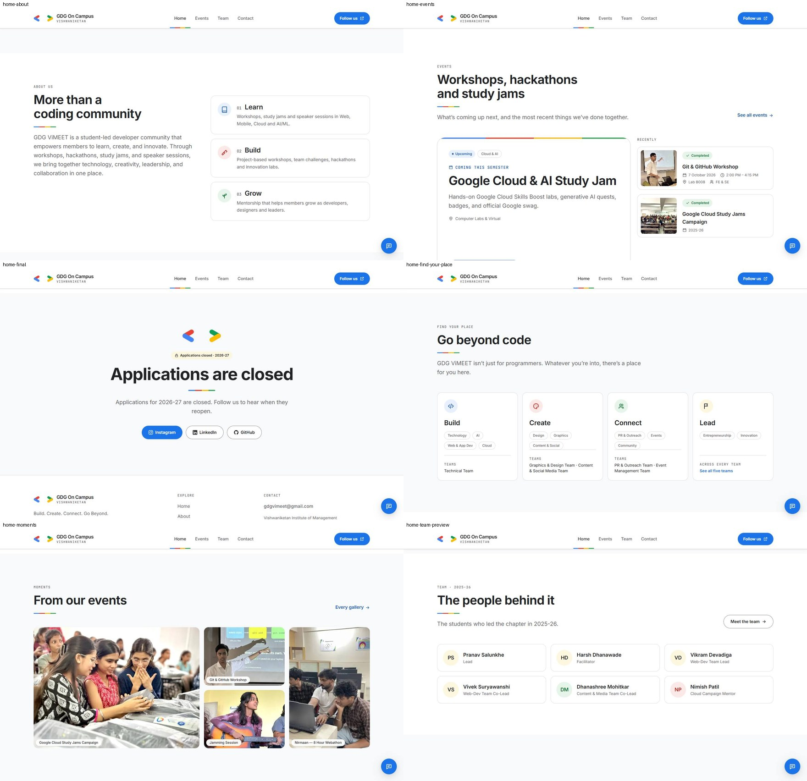

# Stages 4 + 5 — Content pages, polish and clean-up

Branch `redesign/ui-v2`. Screenshots: [`stage-4-5/`](stage-4-5/). Everything below is built from the data files; no content was invented (dates that are still unknown stay `TODO` in `data/events.js`).

## What shipped

| Area | Result |
|---|---|
| **Home, after the scroll story** | Events (featured upcoming + 3 recent) → Moments (bento of real photos from every event, opens the viewer) → About (Learn · Build · Grow) → Find your place (12 interests → Build / Create / Connect / Lead → the 5 teams) → Team preview → Final CTA driven by `site.recruitmentOpen` → light footer ending in the four-colour stroke |
| **/events** | Editorial layout: the newest event is the lead story, the rest alternate wide/narrow; upcoming card with its date emphasised; category filter with a sliding indicator and a live "n events shown"; status chip (Upcoming / Completed) **derived from the ISO `date`**, never typed by hand |
| **/events/:slug** (new) | One page per event: date · time · venue · audience, figures (Study Jams), gallery bento, accessible lightbox, newer/older navigation, friendly 404 for unknown slugs. Card links used to go to `/join`; they now go to the event |
| **Lightbox** | `role="dialog"` + `aria-modal`, focus trapped and returned to the photo you opened, Esc, ← →, swipe, "3 / 12" counter, per-photo caption, neighbours pre-fetched, chat launcher steps aside |
| **Photos** | Every photo has `-480` / `-960` copies served through `srcset` (`scripts/make-image-variants.mjs`; ~1 MB → ~0.2–0.4 MB on a phone). **All 65 photos have written alt text** describing the moment (in `data/events.js`, `photoAlts`) — please skim them |
| **/team** | Five recruitment teams with line icons + open/closed chip; faculty as a compact list; 2025-26 tenure as collapsible groups with initials avatars (4 brand tints, deterministic) and *labelled* social links (44 px targets) |
| **/contact** | Contact card, address, socials, reasons-to-reach-out; the Google Form and the map are now **click-to-load** (no third-party requests or cookies until you ask; plain link fallback) |
| **/join** | Same fields, validation rules and API payload; restyled as 3 steps with real `<label>`s, `aria-invalid` / `aria-describedby`, focus moves to the first invalid field, radio/checkbox cards with proper keyboard focus, one confetti burst on success with the stroke drawing in. **Fixed a silent failure:** when the API call failed the old page showed nothing; it now shows an error and keeps the form |
| **Chat (Vimi)** | Light surface, solid-blue launcher (no gradient), line icons instead of emoji; on phones it is a full-screen modal (focus trap, scroll lock, launcher hidden), on desktop a corner dialog; `role="log"` + `aria-live` for replies; Esc closes and returns focus to the launcher |
| **Admin** | Restyled with the same tokens (login, shell + drawer, dashboard, applications, queries). **Logic untouched.** The drawer now traps focus |
| **404** | Unknown URLs get a designed page (they used to show React Router's raw error screen) |
| **SEO** | Per-route `<title>` and description; `sitemap.xml` lists every event page |

## Clean-up (Stage 5)

- **Removed:** `animejs`, `motion` (and the photo Stack, GlareHover, old gallery, `Upcoming`/`Social`/`Lucia`/`GoBeyondCode`/`JoinUs`/`Final`/`LegacyHome`, the BMW loader), **`styles/legacy.css`** and the dark theme (the whole site is light; admin included), the Round/Long fonts, `nav-logo.svg`, and the 13 raw `fe-se-gitngithub` originals (23 MB, most with GPS metadata — they remain in git history).
- **Added (dev only):** `sharp`, for the image-variant script. **GSAP + ScrollTrigger is now the only animation engine.**
- **Layout shift fixed:** the footer used to jump when a lazy page chunk arrived (CLS 0.3 on every inner page → 0).
- `public/` went from 37.6 MB to 16 MB.

## Numbers

`vite build`: entry JS **319 kB raw / 102.6 kB gzip** (baseline 644.6 / 212.4; −52% gzip), CSS **53.6 / 10.6 kB gzip** (baseline 86.8 / 14.3). The home page and every other route are their own lazy chunks, so an inner page no longer downloads the scroll-story engine.

Lighthouse (local production build, simulated mobile):

| Page | Perf | A11y | Best practices | SEO | LCP | CLS |
|---|---|---|---|---|---|---|
| Home | **91** quiet run · 73–77 while another process was using 35% CPU | 100 | 100 | 100 | 2.6 s | 0 |
| Team | 92–93 | 100 | 100 | 100 | 2.8–3.0 s | 0 |
| Events | 81–87 | 100 | 100 | 100 | 3.6–3.8 s | 0 |
| Contact | 86–92 | 100 | 100 | 100 | 3.0 s | 0 |
| Home, desktop | **100** | 100 | 100 | 100 | 0.7 s | 0 |

Performance varies by ±15 with machine load on this laptop; **re-run Lighthouse once on the deployed build** for the number to quote. Inner-page LCP (≈3 s) is the one target still above 2.5 s: it is a lazy-chunk + font waterfall on throttled 4G, not an image.

## Checks run (headless Chrome, real input)

- **Lightbox:** opens from the keyboard, arrows step (3→4→2), Tab/Shift+Tab trapped, Esc closes + unlocks scroll + focus returns to the photo.
- **Chat:** keyboard open/close, focus returns; phone = full-screen modal, trapped; menu open hides the launcher.
- **Join form** (against an intercepted API, with applications temporarily open): empty submit → 5 inline errors + focus on the first; bad mobile/email messages; poster-link validation; the exact normalised POST payload; success view; API failure shows an error and keeps the form.
- **Events filter** (All → Workshops → Hackathons), unknown slug → 404, reduced motion → nothing left hidden.
- **Every route** at 1440 and 390: one `h1`, landmarks, no horizontal overflow, no images without `alt`, no broken images, no console errors on cold loads. `eslint`: 0 errors, 0 warnings.
- Admin pages with a mocked session at both widths: no dark surfaces left, no overflow.

## Things I could not do / need from you

- **Dates** for the 2025-26 events (still `TODO`), and a date for the upcoming Study Jam.
- **The 2026-27 team** (the page honestly shows 2025-26) and photos for team members.
- **`og:image`** (1200×630) and a **square favicon** (the logo's wide chevrons don't read at 16 px).
- `team.js` still publishes a personal Gmail for the previous lead (`mailto:` on the avatar row).
- The recruitment form's year list is still `SE / TE / BE` (no FE) and the Ganesh Chaturthi challenge is seasonal — unchanged, not in redesign scope.
- Two events share the title "Git & GitHub Workshop" (2025-26 vs 7 Oct 2026); they have separate pages (`…-2025`, `…-2026`).

## Heads-up: a second session is editing the same folder

While this was being finished, another Claude session started changing `src/story/*` (and a few lines of `ScrollStory.jsx`, `FinalCTA.jsx`, `Moments.jsx`) toward a **calm** story — no rotation, tilt or orbit. That contradicts the scroll-driven-rotation + orbiting-dots version committed in `890a5e3`. This commit leaves the story files alone; whichever direction you want needs to be settled before they are committed.
